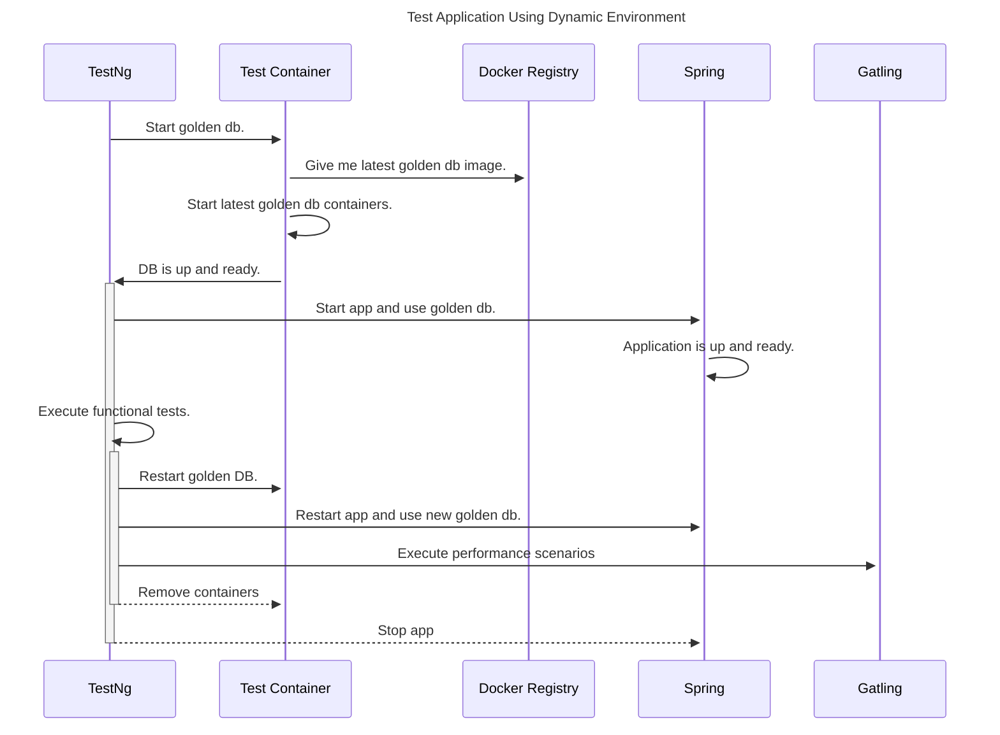

# Athena
In today's competitive software landscape, ensuring high-quality software is paramount for customer satisfaction, brand
reputation, and overall business success.

To address this imperative, it is a necessity to develop a sophisticated software solution that systematically collects
quality metrics throughout the Software Development Life Cycle (SDLC).

"Athena" aims to collect data to proactively identify and address quality-related issues early in the development
process, thereby reducing costs, improving efficiency, and enhancing overall product quality.
Athena will systematically collect metrics related to software development and application quality at each phase of the
SDLC.

In first phase we tend to build enablement to collect metrics from following sources:
* CI/CD pipeline
* Git repository
* Kubernetes infrastructure
* Task management system (Jira/Zephyr)
* Swagger (OpenApi) documentation

In the future, Athena will analyze data and related metrics to provide realtime insight to code quality, performance,
security, and functional correctness.

# Builds locally
To build Athena locally you need ```maven 3.8.6+```, ```JDK-17```, ```docker``` and then simply install packages and run
tests
```shell 
  mvn clean install -U
```

# Test execution sequence

